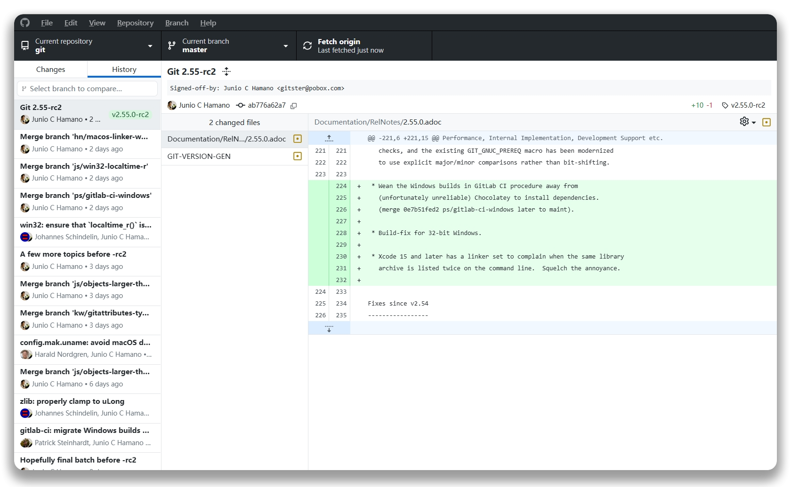

# GitDesk WebUI



<div align="center">

[English README](README.en.md)

</div>

GitDesk WebUI 是基于 [GitHub Desktop](https://github.com/desktop/desktop) 开源代码重构的 WebUI Git 仓库管理面板。它保留了 GitHub Desktop 的主要功能、界面结构和交互逻辑，同时把原本依赖 Electron 本地窗口的运行方式拆分为浏览器前端和 Node.js 后端，便于在 Windows/Linux/Android(Shell) 等环境中可移植部署，并通过桌面浏览器或移动设备远程管理 Git 仓库。

当前 WebUI 已基本完成原版 Desktop 功能的迁移，并针对 Web运行时、远程访问、多平台部署和若干原版/移植过程中暴露的 Git工作流边界问题做了加固。

该项目不是 GitHub 官方发布的 GitHub Desktop 。它复用了 GitHub Desktop 的开源代码、MIT 许可和上游代码设计，并在此基础上提供了独立的 WebUI 构建与部署逻辑。

## 核心特性

- **Web 化的 GitHub Desktop 体验**：保留仓库列表、Changes、History、branch、commit、amend、stash、discard、fetch、pull、push、publish、force push、tag、Pull Request、checks 等完整逻辑；
- **WebUI 专用运行时**：基于 Electron API 重构的 Web shim、浏览器菜单 shim、远程 dispatcher/store、WebUI 账户/Token 隔离等支持；
- **多提交操作**：支持 cherry-pick、squash、reorder/rebase 等历史提交整理流程，包含进度窗口、冲突处理、成功提示、Undo 和 Abort 保护；
- **远程和移动管理**：后端负责 Git、文件系统、GitHub API、Copilot运行时和配置持久化，浏览器端通过 RPC 与 SSE 接收状态更新，适合部署到远程主机、局域网设备或移动终端访问；
- **跨平台部署**：同一套构建产物可按配置部署到 Windows、Linux 和 POSIX-like 环境，运行入口为 `run-webui.ps1` / `run-webui.sh`；
- **Copilot**：支持 Copilot 生成提交信息/解决合并冲突。

## 后续更新计划

WebUI 目前已初步完成了原版 Desktop 功能的移植，但由于 WebUI 操作逻辑与本地程序相差很大，部分逻辑仍不能完全沿用。后续的版本中，GitDesk WebUI 计划引入：

- [ ] 多语言支持；
- [ ] Web代码编辑器；
- [ ] VSCode Code Server 工作区（Web IDE环境）；
- [ ] Web仓库文件管理（类似本地文件管理器的文件管理逻辑）；
- [ ] Git Shell（用于执行复杂git相关指令的安全的 Web shell 模拟器）；
- [ ] 仓库提交树状图可视化；
- [ ] Action 管理面板（一站式 CI/CD 管理）；
- [ ] ……

## 构建与部署

完整说明参见[docs/technical/webui-build-and-deploy.md](docs/technical/webui-build-and-deploy.md)。

Windows 构建：

```powershell
powershell -ExecutionPolicy Bypass -File .\script\deploy-webui.ps1
powershell -ExecutionPolicy Bypass -File .\script\deploy-webui.ps1 -Production
```

Linux 构建：

```bash
bash script/deploy-webui.sh
bash script/deploy-webui.sh --production
```

启动配置位于 `out/server.conf`。构建脚本不会自动启动 WebUI，部署时复制完整 `out` 目录，然后按目标平台启动：

```powershell
cd out
powershell -ExecutionPolicy Bypass -File .\run-webui.ps1
```

```bash
cd out
chmod +x ./run-webui.sh
./run-webui.sh
```

## 开发入口

常用 WebUI 命令：

```bash
yarn compile:webui
yarn compile:webui:prod
yarn start:webui
```

WebUI 前端入口、远程运行时和后端入口主要位于：

- `app/src/ui/web-index.tsx`
- `app/src/ui/runtime`
- `app/src/ui/platform/*web-shim*`
- `app/src/web-server`
- `script/compile-webui.js`
- `script/deploy-webui.ps1`
- `script/deploy-webui.sh`

## 许可与商标

- 本项目继承 GitHub Desktop 开源代码的 [MIT](LICENSE) 许可。MIT 许可协议不适用于 GitHub 的商标，包括其徽标设计，GitHub 保留对其所有商标的全部商标权和版权。

- GitHub® 及其风格化版本以及 Invertocat 标志均为 GitHub 的商标或注册商标。使用 GitHub 徽标时，请务必遵守 GitHub 徽标使用指南。

<!-- 这是一个访客统计，用来看看我的项目主页有多少人访问过 -->
<div align="center">
  
</div>
<div align="center">
  
</div>
